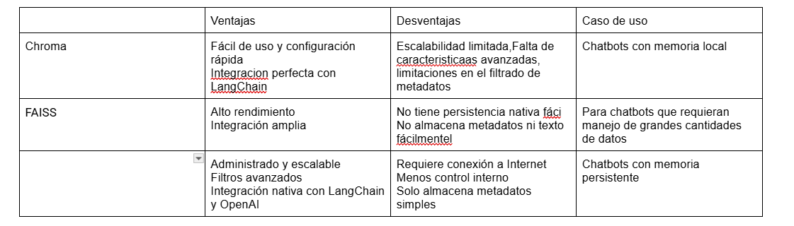

"# ia_lanchaing"

//concluciones

Se probaron dos tipos de bases vectoriales en el archivo de investigacion se uso FASS junto con ollama.3 el resultado obtenido es que al ser un modelo local son mucho mas lentas las respuestas llegando a tardar mas de media hora

Tambien se utilizo el modelo de embedding all-minin con el cual no note mucha diferencia con el que se nos proporciono en el ejemplo
